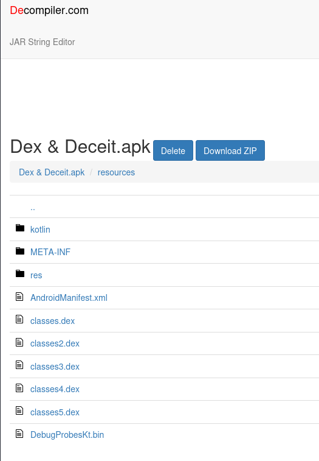
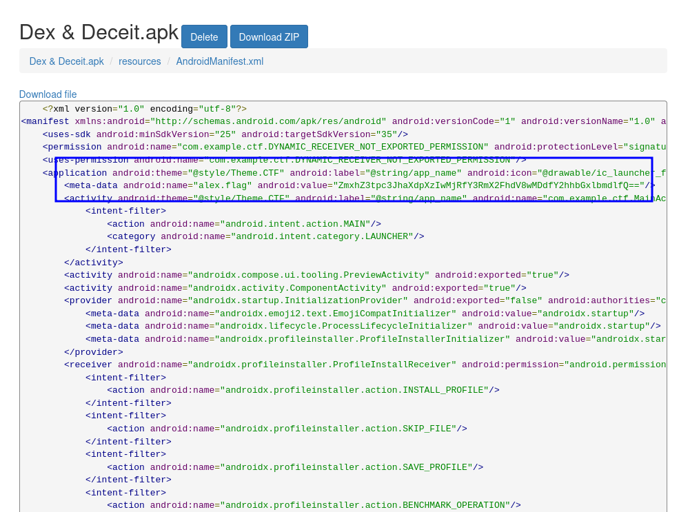

# Dex & Deceit — Writeup  
## Challenge Type: Easy Reverse Engineering  

---

### 🧩 Description
We were given an APK file and a hint suggesting that something interesting might be hidden inside the XML files.

---

### 🧠 Solution

#### 1. Extract the archive
The provided file was a **.rar** archive, so first step was to extract it:
```bash
unrar x 'Dex & Deceit.rar'
```

**Output:**
```bash
ls
'Dex & Deceit'  'Dex & Deceit.rar'
cd 'Dex & Deceit'
ls
'Dex & Deceit.apk'   META-INF   res     smali_classes2   smali_classes4   unknown
kotlin               original   smali   smali_classes3   smali_classes5
```

---

#### 2. Inspect the APK
Inside, we found an **APK** file.  
To analyze it, I used **JADX**, which allows easy decompilation and viewing of resources.  
For convenience, I used **JADX Online**.



---

#### 3. Explore resources
After uploading the APK to JADX and exploring the **resources**,  
I opened the `AndroidManifest.xml` file.



There, I found a suspicious **Base64**-encoded string.

---

#### 4. Decode the Base64 string
To decode it, run:
```bash
echo "ZmxhZ3tpc3JhaXdpXzIwMjRfY3RmX2FhdV8wMDdfY2hhbGxlbmdlfQ==" | base64 -d
```

**Output:**
```
flag{israiwi_2024_ctf_aau_007_challenge}
```

---

### 🏁 Flag
```
flag{israiwi_2024_ctf_aau_007_challenge}
```

---
