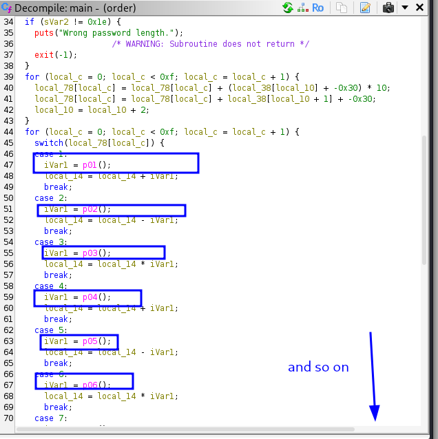
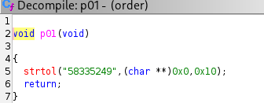

# Order Matters

**CTF:** SunshineCTF 2018

**Challenge title:** Order Matters

**Author:** Winyl

---

## Challenge description

The vault protecting an armory uses an unusual password algorithm. Your task is to reverse the binary called `order`, recover the hidden data, and produce the flag. A hint given by the author: the password is a sequence of unique numbers (e.g. `1 2 11 12` → `01021112`). The provided binary is named `order`.

---

## Executive summary

- The target is a PIE-enabled ELF x86_64 binary named `order`.
- Static analysis revealed several 8-character hex strings embedded in the binary. These decode to short Base64 fragments when interpreted as raw bytes.
- Concatenating and Base64-decoding those fragments yields a candidate flag-like string which required reordering to obtain the final flag.


---


## Recon

1. Inspect the binary type and protections:

```bash
file order
# -> ELF 64-bit LSB pie executable, x86-64
```

2. Extract printable strings to locate potentially embedded data:

```bash
strings order
```

```text
/lib64/ld-linux-x86-64.so.2
:.4*`s
libc.so.6
exit
__isoc99_scanf
puts
printf
strtol
strlen
__cxa_finalize
__libc_start_main
GLIBC_2.7
GLIBC_2.2.5
_ITM_deregisterTMCloneTable
__gmon_start__
_ITM_registerTMCloneTable
=Z%.ou
AWAVI
AUATL
[]A\A]A^A_
58335249
58306c45
5a314e66
63335675
58335177
51563969
4e484a45
66513d3d
4d313935
59544578
4d313943
4d486c7a
6532315a
5831526f
556a4675
Enter password: 
Wrong password length.
Access Granted
Access Denied.
;*3$"
GCC: (Debian 7.2.0-19) 7.2.0
crtstuff.c
deregister_tm_clones
__do_global_dtors_aux
completed.7027
__do_global_dtors_aux_fini_array_entry
frame_dummy
__frame_dummy_init_array_entry
order_rev.c
__FRAME_END__
__init_array_end
_DYNAMIC
__init_array_start
__GNU_EH_FRAME_HDR
_GLOBAL_OFFSET_TABLE_
__libc_csu_fini
_ITM_deregisterTMCloneTable
puts@@GLIBC_2.2.5
_edata
strlen@@GLIBC_2.2.5
printf@@GLIBC_2.2.5
__libc_start_main@@GLIBC_2.2.5
__data_start
__gmon_start__
strtol@@GLIBC_2.2.5
__dso_handle
_IO_stdin_used
__libc_csu_init
__bss_start
main
__isoc99_scanf@@GLIBC_2.7
exit@@GLIBC_2.2.5
__TMC_END__
_ITM_registerTMCloneTable
__cxa_finalize@@GLIBC_2.2.5
.symtab
.strtab
.shstrtab
.interp
.note.ABI-tag
.note.gnu.build-id
.gnu.hash
.dynsym
.dynstr
.gnu.version
.gnu.version_r
.rela.dyn
.rela.plt
.init
.plt.got
.text
.fini
.rodata
.eh_frame_hdr
.eh_frame
.init_array
.fini_array
.dynamic
.got.plt
.data
.bss
.comment
```
- we can see a sequence of numbers here (
58335249
58306c45
5a314e66
63335675
58335177
51563969
4e484a45
66513d3d
4d313935
59544578
4d313943
4d486c7a
6532315a
5831526f
556a4675)      

---

## Static analysis (Ghidra)

-after opening the order binary in Ghidra, it was found that the program handles ASCII Hex strings and converts them to integers using strtol("HEX_STRING", NULL, 16) in each function from p01() to p15().




---

## Data extraction and decoding

I wrote a short Python script to convert each 8-char hex string into raw bytes, interpret them as ASCII, and print the fragments. The fragments are Base64 substrings which, when concatenated and decoded, produced the intermediate result.

```python
# solve.py
hex_values = [
    "58335249","58306c45","5a314e66","63335675","58335177",
    "51563969","4e484a45","66513d3d","4d313935","59544578",
    "4d313943","4d486c7a","6532315a","5831526f","556a4675"
]

for h in hex_values:
    if len(h) % 2:
        continue
    print(bytes.fromhex(h).decode('utf-8', errors='ignore'))
```

Usage:

```bash
python3 solve.py > solve.txt
cat solve.txt | base64 -d
```

The decoded output was a partial flag-like string that required ordering.
```text
_tH_IDsun_t0A_b4rD}3_ya113_B0ys{mY_ThR1n  
```
i just orderd it myself

---
<details>
  <summary>Click to reveal the flag</summary>

  **FLAG:** `FLAG{sun{mY_IDA_bR1ngS_a11_Th3_B0ys_t0_tH3_y4rD}}`

</details>


