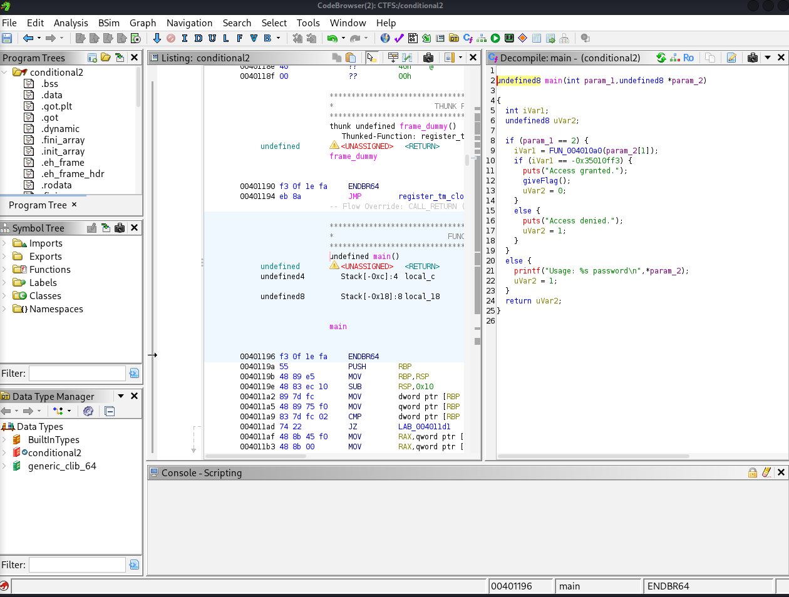
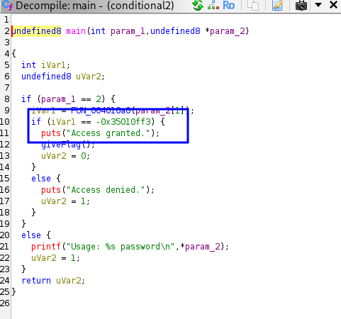

# Conditional 2 — 10 pt

**Competition / Platform:** hackucf.org  
**Category:** Reverse  
**Environment:** Linux x86_64, gdb, pwndbg, Ghidra  
**Author:** kablaa  
**File Name:** conditional2  

---

## Description
Let me introduce you to my good friend, IDA Pro.

## Steps / Solution
1. Make the program executable:
-chmod +x conditional2
2.run the program with any pass:
./conditional2 123
The program prints Access denied. — the input is incorrect.
3.Search for strings inside the binary:
strings conditional2 | grep password
We only see the usage message: Usage: %s password.
**
No obvious password or flag is visible, which means the flag is likely computed or checked programmatically, not stored as plain text
**
4.Reason to use Ghidra
Since strings did not reveal the password, we need to analyze the binary in a disassembler/decompiler like Ghidra.
This allows us to see the logic of the program, including functions, comparisons, and the actual password check.

as we can see in the main:

python3 -c "print(-0x35010ff3)"

-889262067
here we go:
./conditional2 -889262067        
Access granted.
flag{at_least_this_cafe_wont_leak_your_credit_card_numbers}

