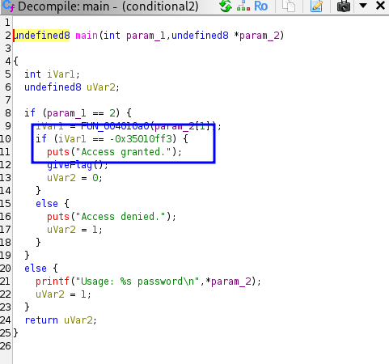

# Conditional 2 — 10 pt

**Competition / Platform:** hackucf.org  
**Category:** Reverse  
**Environment:** Linux x86_64, gdb, pwndbg, Ghidra  
**Author:** kablaa  
**File Name:** conditional2  

---

## Description
Let me introduce you to my good friend, IDA Pro.

---

## Steps / Solution

1. **Make the program executable:**
   ```bash
   chmod +x conditional2
   ```

2. **Run the program with any password:**
   ```bash
   ./conditional2 123
   ```
   The program prints:
   ```
   Access denied.
   ```
   — the input is incorrect.

3. **Search for strings inside the binary:**
   ```bash
   strings conditional2 | grep password
   ```
   We only see the usage message:
   ```
   Usage: %s password
   ```
   **No obvious password or flag is visible**, which means the flag is likely computed or checked programmatically, not stored as plain text.

4. **Reason to use Ghidra**  
   Since strings did not reveal the password, we need to analyze the binary in a disassembler/decompiler like Ghidra.  
   This allows us to see the logic of the program, including functions, comparisons, and the actual password check.

   

   As we can see in the main function:

   

5. **Calculate the required number using Python:**
   ```bash
   python3 -c "print(-0x35010ff3)"
   ```
   Output:
   ```
   -889262067
   ```

6. **Run the program with the correct password:**
   ```bash
   ./conditional2 -889262067
   ```
   The program prints:
   ```
   Access granted.
   flag{at_least_this_cafe_wont_leak_your_credit_card_numbers}
   ```
