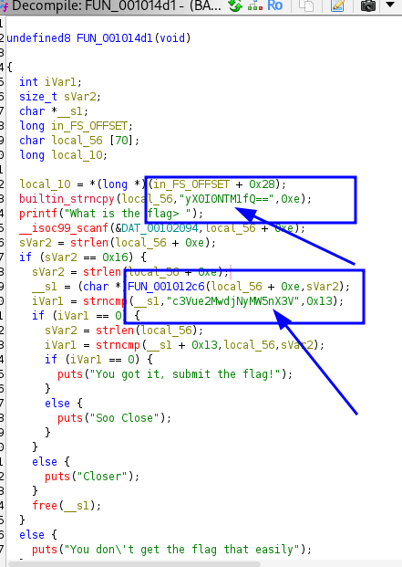

# BASEic — SunshineCTF 2025

---

## Challenge
**Name:** BASEic  
**Category:** Reverse / Binary  
**Platform:** ELF x86_64 (PIE, stripped)  

**Description:**  
A small stripped ELF PIE binary hides a Base64-encoded blob inside its static data.  
Goal: recover and decode that blob to reveal the flag.

---

## Recon
Start with basic reconnaissance. Stripping only removes symbols; static sections like `.rodata` often still leak clues.

### Quick checks
```bash
file BASEic
```
**Output:**
```text
BASEic: ELF 64-bit LSB pie executable, x86-64, version 1 (SYSV), dynamically linked, interpreter /lib64/ld-linux-x86-64.so.2, BuildID[sha1]=4c27a8522e5cde996407511f18c475d48dda4ea9, for GNU/Linux 3.2.0, stripped
```

```bash
strings BASEic
```
**Output:**
```text
/lib64/ld-linux-x86-64.so.2
__cxa_finalize
malloc
__libc_start_main
strncmp
puts
free
strlen
__isoc99_scanf
__stack_chk_fail
printf
libc.so.6
GLIBC_2.7
GLIBC_2.4
GLIBC_2.34
GLIBC_2.2.5
_ITM_deregisterTMCloneTable
__gmon_start__
_ITM_registerTMCloneTable
PTE1
u+UH
yX0I0NTMH
1fQ=f
c3Vue2MwdjNyMW5nX3V
ABCDEFGHIJKLMNOPQRSTUVWXYZabcdefghijklmnopqrstuvwxyz0123456789+/
What is the flag> 
%40s
You got it, submit the flag!
Soo Close
Closer
You don't get the flag that easily
:*3$"
GCC: (Ubuntu 11.4.0-1ubuntu1~22.04) 11.4.0
.shstrtab
.interp
.note.gnu.property
.note.gnu.build-id
.note.ABI-tag
.gnu.hash
.dynsym
.dynstr
.gnu.version
.gnu.version_r
.rela.dyn
.rela.plt
.init
.plt.got
.plt.sec
.text
.fini
.rodata
.eh_frame_hdr
.eh_frame
.init_array
.fini_array
.dynamic
.data
.bss
.comment
```

---

### 1. Open the binary in Ghidra or any tool
```bash
ghidra
```
**Explanation:**
- Ghidra is a disassembler/analysis tool.
- We open the binary to inspect the `.rodata` section and locate potential Base64-encoded strings.


     
     
---
### 2. Attempt decoding partial Base64 strings
```bash
echo "yX0I0NTM1fQ==" | base64 -d
```
**Output:**
```
������base64: invalid input
```
**Explanation:**
- This fragment alone is not a complete valid Base64 string, so decoding fails.


```bash
echo "c3Vue2MwdjNyMW5nX3V" | base64 -d
```
**Output:**
```
sun{c0v3r1ng_ubase64: invalid input
```
**Explanation:**
- This is part of the encoded data, but still incomplete, so decoding is partially successful but invalid at the end.


### 3. Combine fragments and decode complete Base64 string
```bash
echo "c3Vue2MwdjNyMW5nX3VyX0I0NTM1fQ==" | base64 -d
```
**Output:**
```
sun{c0v3r1ng_ur_B4535}
```
**Explanation:**
- After combining all fragments found in the binary, we get a valid Base64 string.
- Decoding this complete string gives us the flag.
---

## Conclusion
**Flag:** `sun{c0v3r1ng_ur_B4535}`

